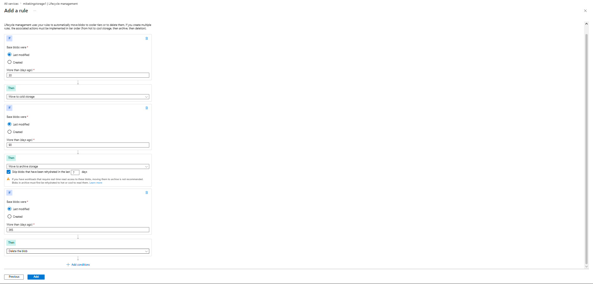
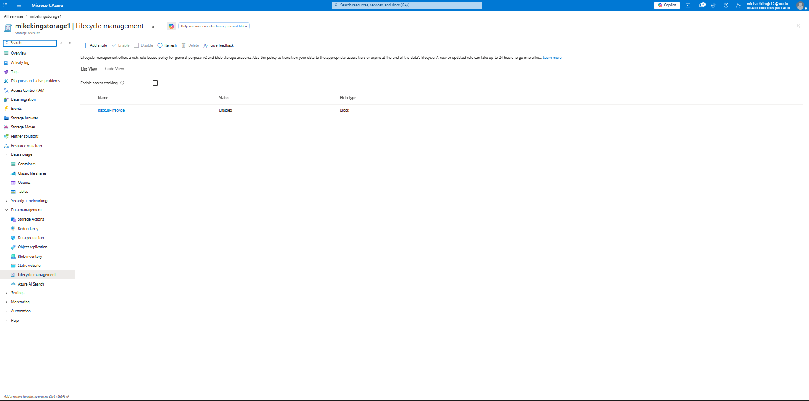
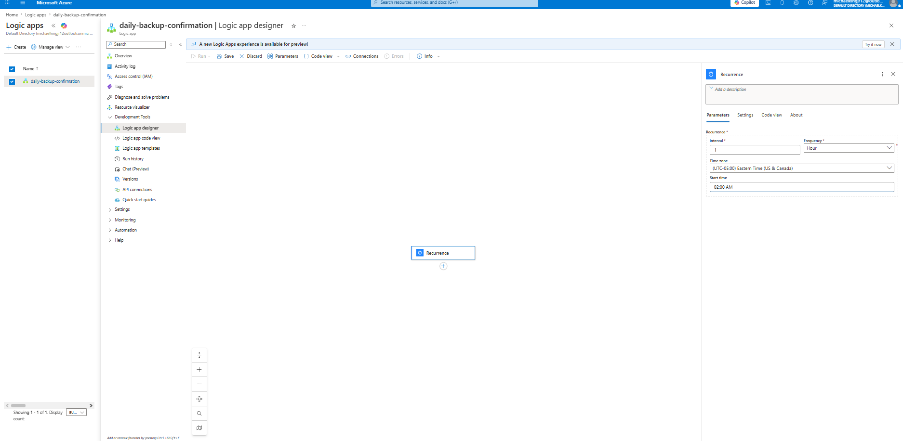
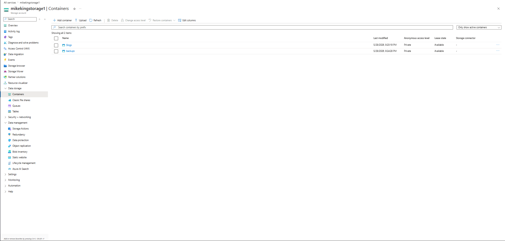
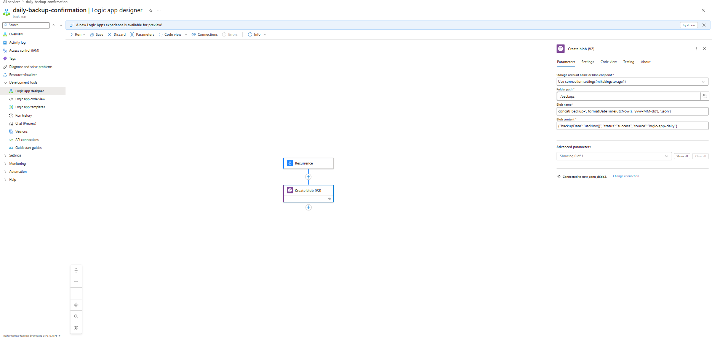
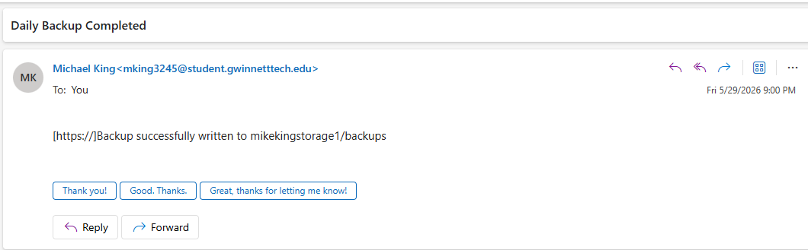
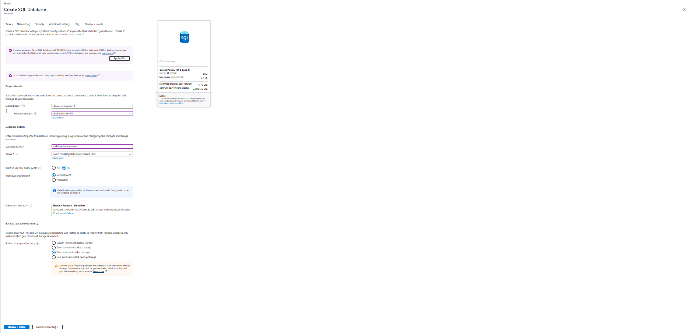
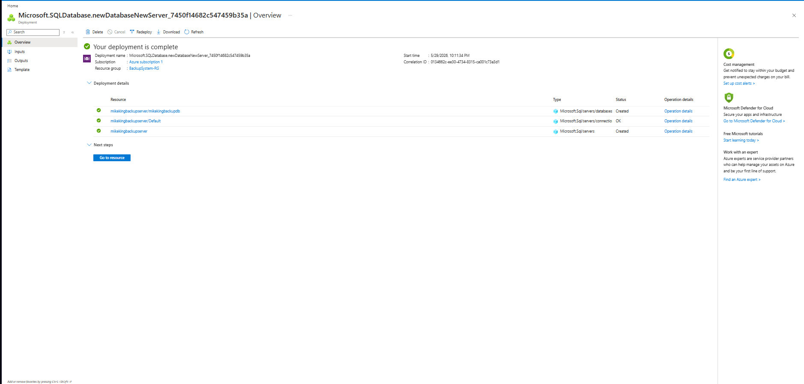

# 🔄 Azure Automated Backup System

> **Problem:** Backups depend on someone remembering — until data is just gone.  
> **Solution:** Fully automated daily backup pipeline using Azure Blob Storage, Azure SQL, and Logic Apps.

---

## 📐 Architecture

```
Daily Trigger (Logic App - 2AM UTC)
            ↓
  Execute SQL Query (BackupLog table)
            ↓
  Write to Blob Storage (/backups)
       ↙              ↘
✅ Success Email    ❌ Failure Alert Email
```

---

## 📸 Screenshots

### Lifecycle Management Policy (30 → 90 → 365 days)


### Lifecycle Rule Active on Storage Account


### Logic App Designer — Recurrence Trigger (2AM Eastern)


### Blob Container — backups ready


### Logic App Designer — Full Flow


### Confirmation Email Received


### SQL Server Creation — SQL Authentication


### SQL Server + Database Deployment Complete


---

## ☁️ Azure Resources

| Resource | Name | Purpose |
|---|---|---|
| Resource Group | `BackupSystem-RG` | Contains all resources |
| Storage Account | `mikekingstorage1` | Hosts the backup blob container |
| Blob Container | `backups` | Stores daily backup JSON files |
| SQL Server | `mikekingbackupserver` | Logical SQL server |
| SQL Database | `mikekingbackupdb` | Contains the `BackupLog` table |
| Logic App | `daily-backup-confirmation` | Orchestrates the entire workflow |

---

## 🔧 Components

### 1. Azure Blob Storage + Versioning
- Storage account with blob versioning enabled
- Private `backups` container (no public access)
- Connected to Logic App via access key

### 2. Lifecycle Management Policy
Blobs in the `backups` container automatically transition:

| Age | Action |
|---|---|
| 30 days | Move to Cool storage |
| 90 days | Move to Archive storage |
| 365 days | Delete blob |
| Versions > 180 days | Delete old versions |

### 3. Azure SQL Database
- Server: `mikekingbackupserver.database.windows.net`
- Database: `mikekingbackupdb`
- Auth: SQL authentication (`sqladmin`)
- Firewall: Azure services allowed + client IP added

```sql
CREATE TABLE dbo.BackupLog (
    Id INT IDENTITY(1,1) PRIMARY KEY,
    BackupDate DATETIME DEFAULT GETUTCDATE(),
    FileName NVARCHAR(255),
    Status NVARCHAR(50),
    Notes NVARCHAR(500)
);
```

### 4. Logic App Workflow
Runs daily at **2:00 AM Eastern** and executes:

1. **Recurrence trigger** — daily schedule
2. **Execute SQL Query** — `SELECT * FROM dbo.BackupLog`
3. **Create Blob** — writes to `/backups/backup-YYYY-MM-DD.json`
4a. **Send Success Email** — confirmation on success
4b. **Send Failure Email** — parallel branch, fires only on failure/timeout/skip

---

## 🚀 Deployment

### Prerequisites
- Azure subscription
- Azure CLI installed

### Deploy Lifecycle Policy
```bash
az deployment group create \
  --resource-group BackupSystem-RG \
  --template-file blob-lifecycle-policy.json \
  --parameters storageAccountName=mikekingstorage1
```

### Deploy Logic App
```bash
az deployment group create \
  --resource-group BackupSystem-RG \
  --template-file logicapp-daily-backup.json \
  --parameters \
      storageAccountName=mikekingstorage1 \
      storageAccountKey=<your-key> \
      notificationEmail=your@email.com
```

### Authorize Office 365 Connection (one-time manual step)
1. Azure Portal → Logic Apps → `daily-backup-confirmation`
2. API connections → `office365-connection` → **Authorize**
3. Sign in with your Microsoft 365 account

### SQL Firewall (required for Logic App to connect)
In `mikekingbackupserver` → Security → Networking:
- ✅ Allow Azure services and resources to access this server
- ✅ Add your client IP address

---

## 📁 Repository Structure

```
├── README.md
├── blob-lifecycle-policy.json
├── logicapp-daily-backup.json
├── logicapp-updated-with-sql-and-failover.json
└── screenshots/
    ├── 01-lifecycle-policy-rules.png
    ├── 02-lifecycle-management-active.png
    ├── 03-logic-app-recurrence-trigger.png
    ├── 04-blob-containers.png
    ├── 05-logic-app-full-flow.png
    ├── 06-confirmation-email.png
    ├── 07-sql-server-creation.png
    └── 08-sql-deployment-complete.png
```

---

## 📧 Email Alerts

**Success (fires after blob write succeeds):**
> Subject: `Daily Backup Completed`
> Body: Backup successfully written to `mikekingstorage1/backups`

**Failure (parallel branch — fires if blob write fails/times out/skipped):**
> Subject: `❌ BACKUP FAILED - Action Required`
> Body: The daily backup job failed. Check Logic App run history immediately.

---

## 💰 Cost Estimate

| Resource | Estimated Monthly Cost |
|---|---|
| Blob Storage (LRS, Cool tier after 30 days) | ~$0.01/GB |
| Azure SQL (Serverless free tier) | $0 (100k vCore seconds free) |
| Logic App (Consumption, 1 run/day) | ~$0.01 |
| **Total** | **~$1–5/month** |

---

## 🔒 Security Notes

- Storage access key should be rotated every 90 days
- Consider **Managed Identity** for keyless auth (no access key needed)
- SQL firewall restricts to Azure services + your IP only
- All containers set to **Private** access level
- Blob versioning enabled — deleted/overwritten files are recoverable

---

## ⚠️ Cleanup

To delete all resources and stop all charges:

```bash
az group delete --name BackupSystem-RG --yes --no-wait
```

> ⚠️ This permanently deletes the storage account, SQL server, database, Logic App, and all backup data.

---

## 📊 Monitoring

- **Run history**: Azure Portal → `daily-backup-confirmation` → Run history
- **Blob files**: `mikekingstorage1` → Containers → `backups`
- **SQL data**: Query Editor → `SELECT * FROM dbo.BackupLog`

---

*Built on Azure — May 2026*
